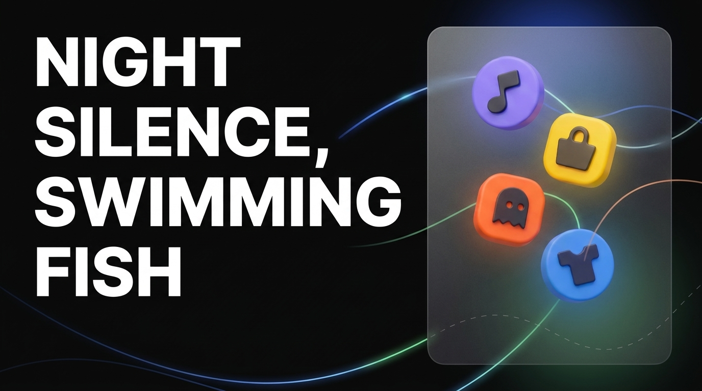

# CHEOLSOON | UI Portfolio

Nuxt 3 기반의 개인 포트폴리오 사이트입니다.  
GSAP, Lenis, Three.js, Matter.js 등을 활용해 스크롤 인터랙션, 애니메이션, 3D/물리 기반 실험 페이지를 담고 있습니다.

## 미리보기



## 주요 특징

- 포트폴리오 메인 랜딩 페이지
- `Archives` 섹션에서 실제 프로젝트 아카이브를 상세 페이지로 소개
- `Experiments` 섹션에서 WebGL, Canvas, Physics, Interaction 기반 실험을 탐색 가능
- 반응형 레이아웃과 스크롤 기반 모션 연출
- GitHub Pages 배포를 고려한 `baseURL` 설정

## 기술 스택

- Nuxt 3
- Vue 3
- Pinia
- GSAP
- Lenis
- Three.js
- Matter.js
- Cannon-es
- Sass
- @nuxt/image
- @nuxt/icon
- @vueuse/nuxt
- @nuxtjs/google-fonts

## 라우트

- `/` - 메인 포트폴리오
- `/archives` - 프로젝트 아카이브 목록
- `/archives/monimo`
- `/archives/lisn`
- `/archives/meum`
- `/experiments` - 실험 목록
- `/experiments/pinball`
- `/experiments/card`
- `/experiments/glitch`
- `/experiments/brush`
- `/experiments/dot`
- `/experiments/moebius`
- `/experiments/painterly`
- `/experiments/pencil`
- `/experiments/pixel`
- `/experiments/roll`
- `/experiments/burn`

## 실행 방법

의존성 설치:

```bash
npm install
```

개발 서버 실행:

```bash
npm run dev
```

프로덕션 빌드:

```bash
npm run build
```

프로덕션 미리보기:

```bash
npm run preview
```

정적 사이트 생성:

```bash
npm run generate
```

GitHub Pages 배포:

```bash
npm run deploy
```

## 설정 메모

- `nuxt.config.ts`에서 `app.baseURL`이 `/portfolio/`로 설정되어 있습니다.
- 정적 자산은 `public/` 아래에 위치합니다.
- 전역 스타일은 `assets/css/main.css`에서 관리합니다.
- 페이지 전환 상태와 스크롤 상태는 Pinia store에서 관리합니다.

## 배포

이 저장소는 GitHub Pages 배포를 염두에 두고 구성되어 있습니다.
정적 배포 시 `generate` 결과물과 `deploy` 스크립트를 사용합니다.
